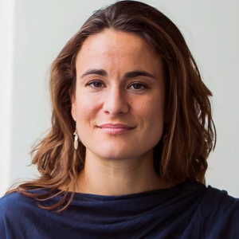
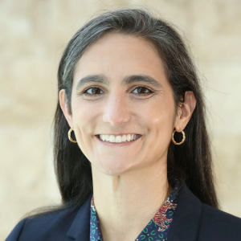

**2nd Social Conflict and Political Economy (SCoPE) Workshop**

*University of Sydney, 3-4 June 2025 *

We invite submissions of papers or extended abstracts for the 2nd Social Conflict and Political Economy (SCoPE) workshop, scheduled for 3–4 June 2025 at the University of Sydney campus. This two-day workshop aims to provide a platform for disseminating research and fostering new collaborative relationships among scholars at various career stages.

## Submission 
Please email papers or extended abstracts to scope.conference@sydney.edu.au by midnight (EST) on 31 January 2025.

## Format
Each day of the workshop will feature up to six presentations, with ample time for discussion, Q&A, and networking.

## Invited speakers 

<table>
  <tr>
    <td></td>
    <td></td>
    <td></td>
    <td></td>
  </tr>
  <tr>
    <td>**Pauline Grosjean**</td>
    <td>**Paul Raschky**</td>
    <td>**Ore Koren**</td>
    <td>**Colette Salemi**</td>
  </tr>
  <tr>
    <td>(UNSW)</td>
    <td>(Monash University)</td>
    <td>(Indiana University)</td>
    <td>(University of Victoria)</td>
  </tr>
</table>

## Organizers 
David Ubilava, Ashani Amarasinghe, Justin Hastings, and Andrey Vasnev

## Acknowledgement 
The workshop organizers gratefully acknowledge support from the School of Economics at the University of Sydney and the Australian Research Council. 
